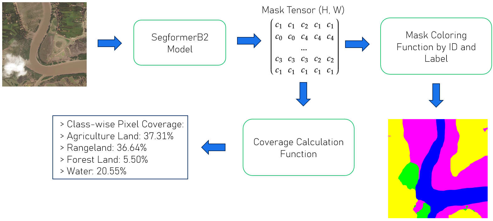

# ASIC - AI for Satellite Image Classification WebApp

This project is a web-based application that allows users to upload satellite images and receive a **segmented output** using [Segformer B2 ADE 20K](https://huggingface.co/nvidia/segformer-b2-finetuned-ade-512-512) model. It simulates an Earth observation tool where land cover types can be detected and visualized.

> This was a team work in collaboration with Andreas Bardram and Theo Lin for our final project in CSCE 625 at Texas A&M University

---

## Features

- Upload a satellite image  
- Segment regions using **SegFormerB2**  
- Visualize the output overlaid on the image  
- Classify each region using a pretrained model
- Calculate each segmented area and represent them in a percentage.

---

## Technologies Used

### Backend
- **Flask** – lightweight Python web server  
- **PyTorch** – to load and run the Segformer B2 model  
- **Segformer B2** – automatic mask generator for segmentation  
- **NumPy**, **Pillow** – image handling  

### Frontend
- **HTML/CSS/JS** – styled with a satellite-dashboard theme  
- **Dynamic UI** – preview both uploaded and segmented images  

### ML Models
- **Segformer B2** – from by Nvidia  
- **PyTorch & Torchvision** - for model implementation

---

## Dataset

The [dataset](https://datasetninja.com/deepglobe) is already divided into train, valid, and test directories where inside each there is a **img/** and **ann/** directories. The **img/** contains the staellite images used and the **ann/** contains JSON files for each satellite image. The JSON files contain bitmaps for each masks that need to be converted. The notebook **convert_masks.ipynb** converts these bitmaps into a mask for each file where each pixel is mapped into a class. It outputs an **np.array()** of size (H, W) for each iamge. The notebook creates a new folder "DeepGlobe_Converted_Dataset" and performs a train/valid split. 

---

## Application Diagram

The diagram below shows the steps the application takes to segment and output the results.



---

## Steps to run ASIC
Clone this repository into your desired location.

```
git clone https://github.com/ASIC.git
```

Download [b2-ade_30_epochs.pth](https://huggingface.co/vmbobato/ASIC/tree/main) from this HuggingFace repository and place it inside **classification_folder/model** folder. 

Go to the repository location.

```
cd ASIC/
```

Install requirements.

```
pip install -r requirements.txt
```

Run the WebApp. 

```
python3 app.py
```

To connect to the WebApp open your browser and visit http://127.0.0.1:5000


